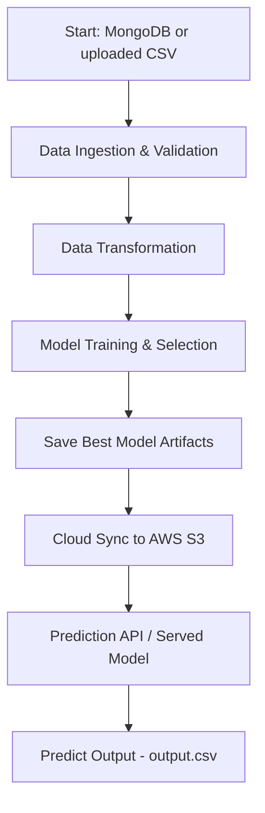

# Network Security

[](https://github.com/AkshatKumarSingh001/Network-Security/actions/workflows/main.yml)
[](https://www.python.org/)
[](LICENSE)

Network Security is an end-to-end machine learning project for network anomaly and intrusion detection using phishing-related security data. It ingests records from MongoDB, validates and transforms the data, trains and compares multiple machine learning models, and exposes a FastAPI service for retraining and prediction.

The project is designed to support MLOps workflows with experiment tracking via MLflow and DagsHub, model artifact persistence, AWS S3 synchronization, containerized deployment, and CI/CD automation for Amazon ECR and EC2.

## Architecture Overview

```mermaid
flowchart LR
    A[MongoDB] --> B[Data Ingestion]
    B --> C[Data Validation]
    C --> D[Data Transformation]
    D --> E[Model Training]
    E --> F[Artifacts / final_model]
    F --> G[AWS S3 Sync]
    E --> H[MLflow + DagsHub]
    I[FastAPI app] --> J[/train]
    I --> K[/predict]
    K --> L[CSV upload]
    L --> M[Model Inference]
    M --> N[Prediction output table]
```

### Pipeline flow

1. Data is read from MongoDB and exported as a pandas DataFrame.
2. The training set and test set are split and stored in the artifact directory.
3. Schema validation and dataset drift checks are performed.
4. Missing values are handled with a KNN imputer during data transformation.
5. Multiple classifiers are evaluated and the best-performing model is saved.
6. Model and preprocessing objects are stored in `final_model/` and synced to AWS S3.
7. The FastAPI app exposes `/train` and `/predict` endpoints for retraining and inference.
8. The application is containerized and deployed through GitHub Actions to Amazon ECR and a self-hosted EC2 runner.

## Tech Stack

- Python 3.10
- FastAPI
- Uvicorn
- scikit-learn
- pandas
- NumPy
- PyMongo
- MongoDB
- MLflow
- DagsHub
- Docker
- AWS ECR
- AWS EC2
- GitHub Actions
- AWS CLI

## Project Structure

```text
.
├── .github/
│   └── workflows/
│       └── main.yml              # CI/CD workflow for integration, ECR, and EC2 deployment
├── Network_Security/
│   ├── cloud/
│   │   └── s3_syncer.py          # S3 sync utilities
│   ├── components/
│   │   ├── data_ingestion.py     # MongoDB ingestion and train/test split
│   │   ├── data_transformation.py# preprocessing and feature transformation
│   │   ├── data_validation.py    # schema validation and drift detection
│   │   └── model_trainer.py      # model evaluation and training logic
│   ├── constant/
│   │   └── training_pipeline.py  # config and constant values
│   ├── entity/
│   │   ├── artifact_entity.py
│   │   └── config_entity.py
│   ├── exception/
│   │   └── exception.py
│   ├── logging/
│   │   └── logger.py
│   ├── pipeline/
│   │   ├── batch_prediction.py
│   │   └── training_pipeline.py  # training pipeline orchestration
│   └── utils/
│       └── main_utils/
├── data_schema/
│   └── schema.yaml               # expected dataset schema
├── final_model/
│   ├── model.pkl                 # trained model artifact
│   └── preprocessor.pkl          # saved preprocessing object
├── templates/
│   └── table.html                # HTML template used for prediction output
├── valid_data/
│   └── test.csv                  # validation/sample data
├── prediction_output/
│   └── output.csv                # prediction results saved by /predict
├── Network_Data/
│   └── phishingData.csv          # source data used in the project
├── app.py                        # FastAPI application
├── main.py                       # entry script for the training pipeline
├── Dockerfile                    # container definition
├── requirements.txt              # Python dependencies
├── setup.py                      # package configuration
├── push_data.py                  # helper for seeding MongoDB
├── test_mongodb.py               # MongoDB connectivity validation
├── README.md                     # project documentation
├── LICENSE                       # MIT license
└── .gitignore
```

## Setup

### Prerequisites

- Python 3.10
- MongoDB instance or MongoDB Atlas connection
- Docker (optional, for containerized deployment)
- AWS CLI and AWS credentials for ECR/EC2 deployment (only required for deployment workflows)

### 1. Clone the repository

```bash
git clone https://github.com/AkshatKumarSingh001/Network-Security.git
cd Network-Security
```

### 2. Create a virtual environment

```bash
python -m venv venv
source venv/bin/activate   # Linux/macOS
# or
venv\Scripts\activate      # Windows
```

### 3. Install dependencies

```bash
pip install -r requirements.txt
```

### 4. Configure environment variables

Create a `.env` file or export the required variables before running the app or training pipeline:

```bash
export MONGO_DB_URL="your_mongodb_connection_string"
export DAGSHUB_USER_TOKEN="your_dagshub_token"
export AWS_ACCESS_KEY_ID="your_aws_access_key_id"
export AWS_SECRET_ACCESS_KEY="your_aws_secret_access_key"
export AWS_REGION="your_aws_region"
export ECR_REPOSITORY_NAME="your_ecr_repository_name"
```

> Replace the placeholder values with your own credentials. These variables are used by the app, pipeline, and deployment workflow.

### 5. Run locally

```bash
python main.py
```

or start the FastAPI app:

```bash
python app.py
```

The app listens on port `8080` by default.

## API Usage

The service exposes the following routes in `app.py`:

### GET /

Redirects to the Swagger documentation page.

```bash
curl -X GET http://localhost:8080/
```

### GET /train

Starts the training pipeline and triggers the ingestion, validation, transformation, and model training workflow.

```bash
curl -X GET http://localhost:8080/train
```

### POST /predict

Uploads a CSV file for inference. The response renders the prediction table in HTML.

```bash
curl -X POST "http://localhost:8080/predict" \
  -F "file=@sample.csv"
```

The app reads the uploaded CSV, loads the saved preprocessing object and model from `final_model/`, runs prediction, saves the output to `prediction_output/output.csv`, and returns the results as an HTML table.

## CI/CD Pipeline

The GitHub Actions workflow is defined in `.github/workflows/main.yml` and contains three main jobs:

### 1. Continuous Integration

- Runs on `ubuntu-latest`
- Checks out the repository
- Executes linting and unit-test placeholders
- Ensures the codebase is in a valid state before delivery

### 2. Continuous Delivery

- Runs after successful integration
- Configures AWS credentials
- Logs in to Amazon ECR
- Builds the Docker image from the repository
- Pushes the image to the configured ECR repository

### 3. Continuous Deployment

- Runs on a `self-hosted` runner
- Pulls the latest container image from Amazon ECR
- Stops the previous container if it exists
- Starts a new container on port `8080`
- Injects environment variables such as `MONGO_DB_URL`, `DAGSHUB_USER_TOKEN`, and AWS config values

This workflow is designed to deploy the service to an Amazon Linux 2023 EC2 host and expose it over port `8080`.

## Docker

The Dockerfile configures a Python 3.10 container and installs dependencies from `requirements.txt` before starting the app.

### Build the image

```bash
docker build -t network-security .
```

### Run the container locally

```bash
docker run -d -p 8080:8080 --name network-security \
  -e MONGO_DB_URL="your_mongodb_connection_string" \
  -e DAGSHUB_USER_TOKEN="your_dagshub_token" \
  network-security
```

Then open:

```text
http://localhost:8080/docs
```

## Contributing

Contributions are welcome. To propose a change:

1. Fork the repository.
2. Create a feature branch.
3. Make your changes and test them locally.
4. Open a pull request with a clear summary of the change.

## License

This project is licensed under the MIT License. See [LICENSE](LICENSE) for details.

## Contact

For questions or collaboration, use the repository owner and GitHub project page associated with this project.
# Network Security — Phishing Detection System

[](https://github.com/AkshatKumarSingh001/Network-Security/actions/workflows/main.yml)
[](https://www.python.org/)
[](https://fastapi.tiangolo.com/)
[](https://mlflow.org/)
[](https://www.docker.com/)
[](https://aws.amazon.com/)
[](LICENSE)

An end-to-end machine learning system for **phishing and network-intrusion detection**, built around a production-style MLOps pipeline. The system ingests security data from MongoDB, validates and transforms it, trains and benchmarks multiple classifiers, tracks experiments via MLflow/DagsHub, persists artifacts to AWS S3, and serves predictions through a FastAPI application — with the full lifecycle automated via GitHub Actions CI/CD to Amazon ECR and EC2.

<p align="center">
  
</p>

---

## Table of Contents

- [Overview](#overview)
- [Architecture](#architecture)
- [Pipeline Workflow](#pipeline-workflow)
- [Tech Stack](#tech-stack)
- [Project Structure](#project-structure)
- [Getting Started](#getting-started)
- [API Reference](#api-reference)
- [Docker](#docker)
- [CI/CD Pipeline](#cicd-pipeline)
- [Contributing](#contributing)
- [License](#license)

---

## Overview

Network Security is a machine learning platform that classifies network/URL records as phishing or legitimate. It is designed as a reference implementation of a production ML system rather than a single notebook model:

- **Data layer** — MongoDB Atlas stores raw phishing records; `push_data.py` seeds the collection.
- **Pipeline layer** — a modular pipeline (ingestion → validation → transformation → training) built around explicit `entity` configs and `artifact` outputs, so each stage is independently testable and traceable.
- **Experimentation layer** — every training run is logged to MLflow and synced to DagsHub for remote experiment tracking.
- **Persistence layer** — trained model and preprocessing objects are saved locally under `final_model/` and synchronized to AWS S3 for durability and downstream deployment.
- **Serving layer** — a FastAPI application exposes `/train` (re-run the pipeline on demand) and `/predict` (batch-score an uploaded CSV) endpoints.
- **Delivery layer** — GitHub Actions builds and pushes a Docker image to Amazon ECR, then deploys it to a self-hosted EC2 runner.

---

## Architecture

The diagram above captures both the static component architecture and the runtime data flow.

**Key components:**

| Component | Responsibility |
|---|---|
| `MongoDB` | System of record for raw phishing/network data |
| `Data Ingestion` | Extracts data from MongoDB, performs train/test split |
| `Data Validation` | Validates dataset schema and checks for data drift |
| `Data Transformation` | Handles missing values via `KNNImputer`, produces model-ready features |
| `Model Trainer` | Trains and evaluates multiple classifiers, selects the best model, logs experiments to MLflow/DagsHub |
| `final_model/` | Serialized best model + preprocessing pipeline |
| `Cloud Sync (s3_syncer.py)` | Pushes local artifacts to AWS S3 |
| `FastAPI app (app.py)` | Serves `/train` and `/predict` endpoints |
| `prediction_output/output.csv` | Persisted batch prediction results |

```mermaid
flowchart LR
    A[(MongoDB)] --> B[Data Ingestion]
    B --> C[Data Validation]
    C --> D[Data Transformation]
    D --> E[Model Trainer]
    E --> F[final_model/ artifacts]
    F --> G[(AWS S3)]
    E --> H[MLflow + DagsHub]
    I[FastAPI app] --> J[/train]
    I --> K[/predict]
    K --> L[CSV upload]
    L --> M[Model Inference]
    M --> N[prediction_output/output.csv]
```

---

## Pipeline Workflow

1. **Ingestion** — `data_ingestion.py` reads records from MongoDB into a pandas DataFrame and produces train/test splits stored under the artifact directory.
2. **Validation** — `data_validation.py` checks the dataset against `data_schema/schema.yaml` and screens for distributional drift between train and test sets.
3. **Transformation** — `data_transformation.py` imputes missing values using `KNNImputer` and outputs model-ready feature sets.
4. **Model Training** — `model_trainer.py` trains and evaluates multiple classifiers, selects the best-performing model, and logs metrics/parameters to MLflow (synced to DagsHub).
5. **Artifact Persistence** — the selected model and its preprocessing object are saved to `final_model/`, then synced to AWS S3 via `s3_syncer.py`.
6. **Serving** — `app.py` exposes:
   - `GET /train` — triggers the full pipeline end-to-end.
   - `POST /predict` — accepts a CSV upload, loads the saved model/preprocessor, runs inference, writes results to `prediction_output/output.csv`, and returns an HTML prediction table.
7. **Deployment** — CI/CD builds a Docker image, pushes it to Amazon ECR, and deploys it to an EC2 host, where the FastAPI service listens on port `8080`.



---

## Tech Stack

| Category | Tools |
|---|---|
| Language | Python 3.10 |
| API | FastAPI, Uvicorn |
| ML / Data | scikit-learn, pandas, NumPy |
| Data Store | MongoDB (PyMongo) |
| Experiment Tracking | MLflow, DagsHub |
| Cloud | AWS S3, ECR, EC2, AWS CLI |
| Containerization | Docker |
| CI/CD | GitHub Actions |

---

## Project Structure

```text
.
├── .github/
│   └── workflows/
│       └── main.yml                # CI/CD workflow — integration, ECR, EC2 deployment
├── Network_Security/
│   ├── cloud/
│   │   └── s3_syncer.py            # S3 sync utilities
│   ├── components/
│   │   ├── data_ingestion.py       # MongoDB ingestion + train/test split
│   │   ├── data_transformation.py  # Preprocessing / feature transformation
│   │   ├── data_validation.py      # Schema validation + drift detection
│   │   └── model_trainer.py        # Model evaluation and training
│   ├── constant/
│   │   └── training_pipeline.py    # Config and constant values
│   ├── entity/
│   │   ├── artifact_entity.py
│   │   └── config_entity.py
│   ├── exception/
│   │   └── exception.py
│   ├── logging/
│   │   └── logger.py
│   ├── pipeline/
│   │   ├── batch_prediction.py
│   │   └── training_pipeline.py    # Training pipeline orchestration
│   └── utils/
│       └── main_utils/
├── data_schema/
│   └── schema.yaml                 # Expected dataset schema
├── final_model/
│   ├── model.pkl                   # Trained model artifact
│   └── preprocessor.pkl            # Saved preprocessing object
├── templates/
│   └── table.html                  # HTML template for prediction output
├── valid_data/
│   └── test.csv                    # Validation / sample data
├── prediction_output/
│   └── output.csv                  # Prediction results from /predict
├── Network_Data/
│   └── phishingData.csv            # Source data used in the project
├── app.py                          # FastAPI application
├── main.py                         # Entry script for the training pipeline
├── Dockerfile                      # Container definition
├── requirements.txt                # Python dependencies
├── setup.py                        # Package configuration
├── push_data.py                    # Helper for seeding MongoDB
├── test_mongodb.py                 # MongoDB connectivity validation
├── README.md
├── LICENSE
└── .gitignore
```

---

## Getting Started

### Prerequisites

- Python 3.10
- A MongoDB instance or MongoDB Atlas connection string
- Docker (optional — for containerized deployment)
- AWS CLI and credentials (only required for ECR/EC2/S3 workflows)

### 1. Clone the repository

```bash
git clone https://github.com/AkshatKumarSingh001/Network-Security.git
cd Network-Security
```

### 2. Create a virtual environment

```bash
python -m venv venv
source venv/bin/activate      # Linux / macOS
venv\Scripts\activate         # Windows
```

### 3. Install dependencies

```bash
pip install -r requirements.txt
```

### 4. Configure environment variables

Create a `.env` file (or export these directly) before running the app or training pipeline:

```bash
export MONGO_DB_URL="your_mongodb_connection_string"
export DAGSHUB_USER_TOKEN="your_dagshub_token"
export AWS_ACCESS_KEY_ID="your_aws_access_key_id"
export AWS_SECRET_ACCESS_KEY="your_aws_secret_access_key"
export AWS_REGION="your_aws_region"
export ECR_REPOSITORY_NAME="your_ecr_repository_name"
```

> Replace all placeholder values with your own credentials. These are consumed by the app, the training pipeline, and the deployment workflow.

### 5. Run locally

Run the training pipeline directly:

```bash
python main.py
```

Or start the FastAPI service:

```bash
python app.py
```

By default, the app listens on port `8080`.

---

## API Reference

The service exposes the following routes, defined in `app.py`.

### `GET /`

Redirects to the interactive Swagger documentation.

```bash
curl -X GET http://localhost:8080/
```

### `GET /train`

Triggers the training pipeline — ingestion, validation, transformation, and model training — end to end.

```bash
curl -X GET http://localhost:8080/train
```

### `POST /predict`

Accepts a CSV upload and returns predictions as an HTML table.

```bash
curl -X POST "http://localhost:8080/predict" \
  -F "file=@sample.csv"
```

The endpoint reads the uploaded CSV, loads the saved preprocessing object and model from `final_model/`, runs inference, writes the results to `prediction_output/output.csv`, and renders the output as an HTML table.

---

## Docker

The `Dockerfile` builds a Python 3.10 container, installs dependencies from `requirements.txt`, and starts the FastAPI app.

### Build the image

```bash
docker build -t network-security .
```

### Run the container locally

```bash
docker run -d -p 8080:8080 --name network-security \
  -e MONGO_DB_URL="your_mongodb_connection_string" \
  -e DAGSHUB_USER_TOKEN="your_dagshub_token" \
  network-security
```

Then open [http://localhost:8080/docs](http://localhost:8080/docs) for the interactive API documentation.

---

## CI/CD Pipeline

Defined in `.github/workflows/main.yml`, the workflow runs three sequential jobs:

### 1. Continuous Integration
- Runs on `ubuntu-latest`.
- Checks out the repository.
- Executes linting and unit-test placeholders.
- Confirms the codebase is in a valid state before delivery.

### 2. Continuous Delivery
- Runs after a successful integration job.
- Configures AWS credentials.
- Authenticates with Amazon ECR.
- Builds the Docker image from the repository.
- Pushes the image to the configured ECR repository.

### 3. Continuous Deployment
- Runs on a `self-hosted` runner.
- Pulls the latest image from Amazon ECR.
- Stops any previously running container.
- Starts a new container on port `8080`.
- Injects runtime environment variables (`MONGO_DB_URL`, `DAGSHUB_USER_TOKEN`, AWS config, etc.).

This pipeline deploys the service to an Amazon Linux 2023 EC2 host, exposed over port `8080`.

---

## Contributing

Contributions are welcome:

1. Fork the repository.
2. Create a feature branch.
3. Make your changes and test them locally.
4. Open a pull request with a clear summary of the change.

---

## License

This project is licensed under the MIT License. See [LICENSE](LICENSE) for details.

## Contact

For questions or collaboration, reach out via the repository owner's GitHub project page: [AkshatKumarSingh001](https://github.com/AkshatKumarSingh001).